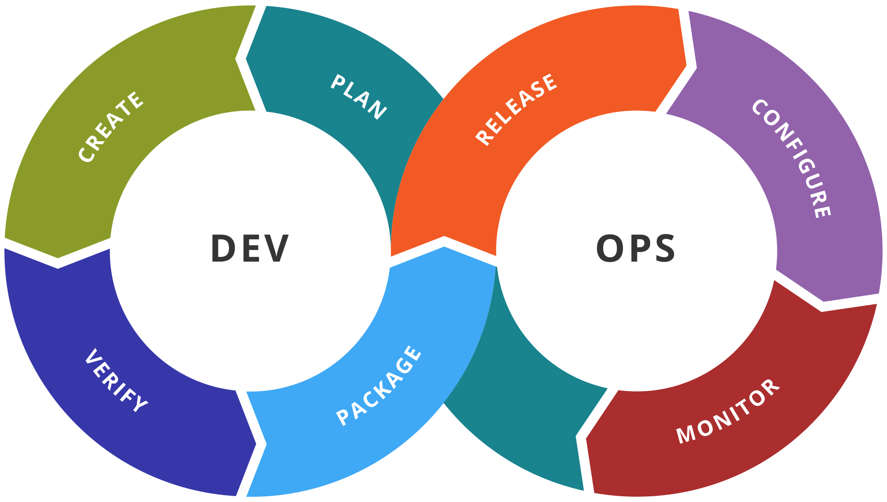

> DevOps is a set of practices, tools, and a cultural philosophy that automate and integrate the processes between software development and IT teams. It emphasizes team empowerment, cross-team communication and collaboration, and technology automation.

Source: https://www.atlassian.com/devops

### My Git TASK
* Create empty readme.txt file.
* Make init commit.
* Create develop branch and checkout on it.
* Create index.html empty file. Commit.
* Create branch with name “images”. Checkout on it. Add images folder with some images inside it. Commit.
* Change your index.html. Add images source inside it. Commit.
* Go back to develop branch.17.Create branch with name“styles”.Checkouton it.Add styles folder with styles source insideit.Commit.
* Change your index.html. Commit.
* Go to develop branch.
* Merge two new branches into develop using git merge command. Resolve conflict if it appear.Do it in next sequence:
- merge “images” into “develop”
- merge “styles” into “develop”
* Do not delete any branches!
* Merge develop into master.
* Try to inspect your repository with git log command. Use different options with this command (git log --help).
* Push all your changes with allyour branches toorigin(git push origin --all).
* Execute command “git reflog“ and save it content somewhere (not in repository) with filename “task1.1_GIT.txt”.
* Add task1.1_GIT.txtto your local repo in then Push it in GitHubrepo