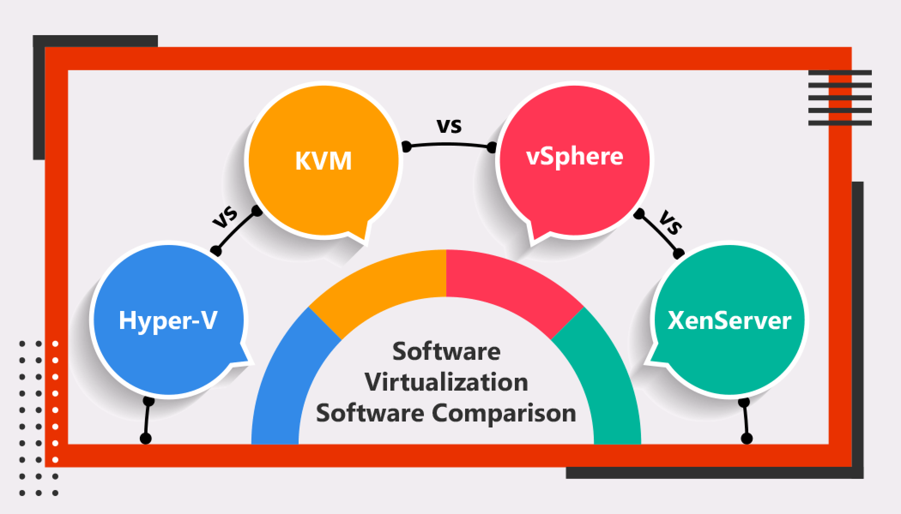
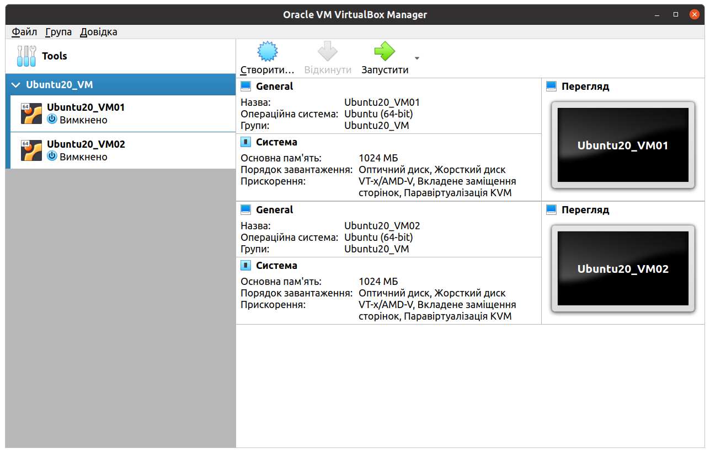
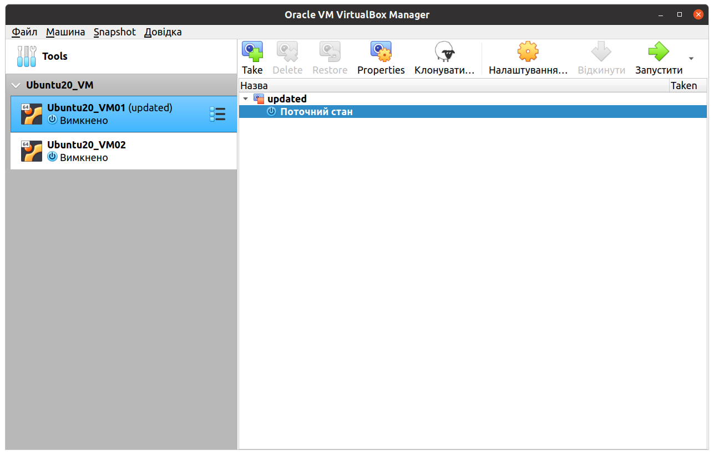
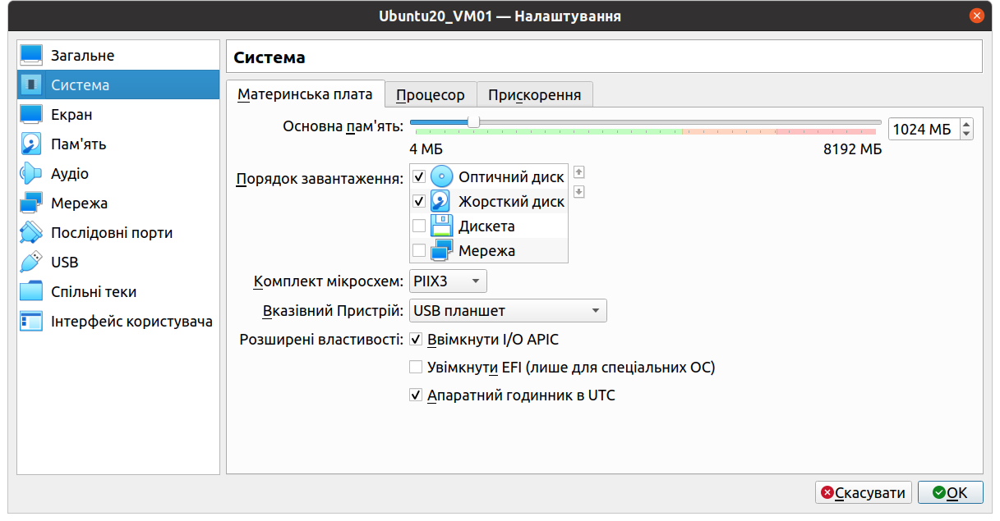
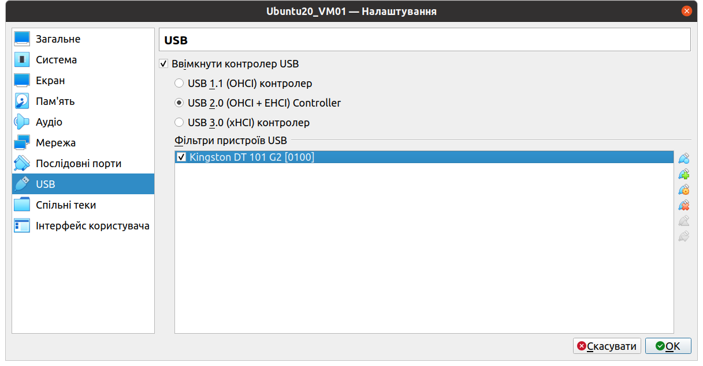
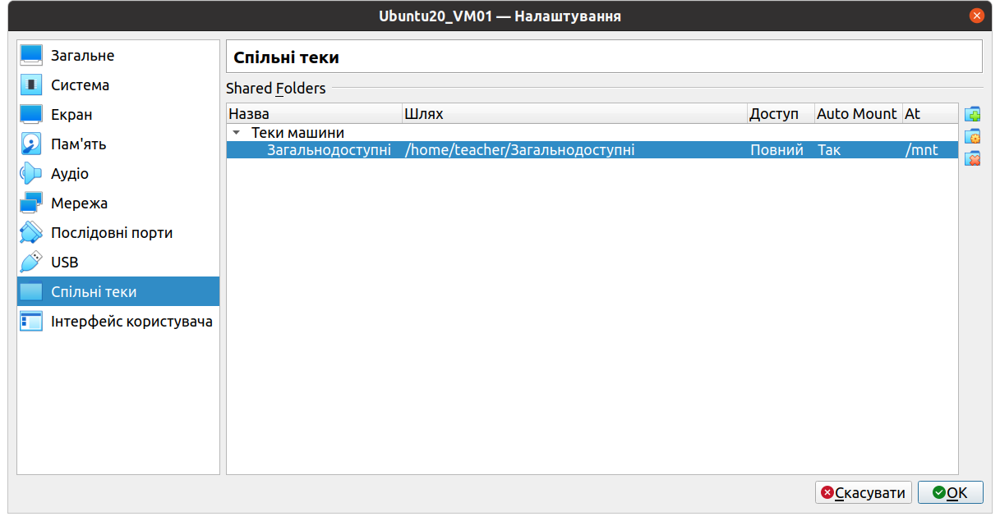
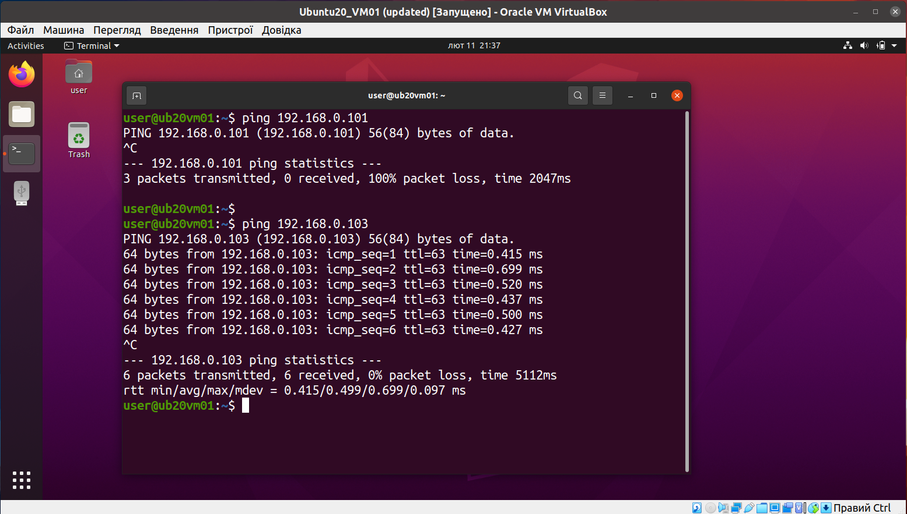
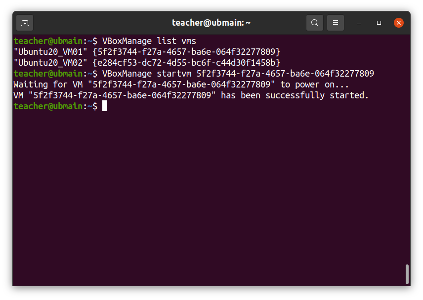
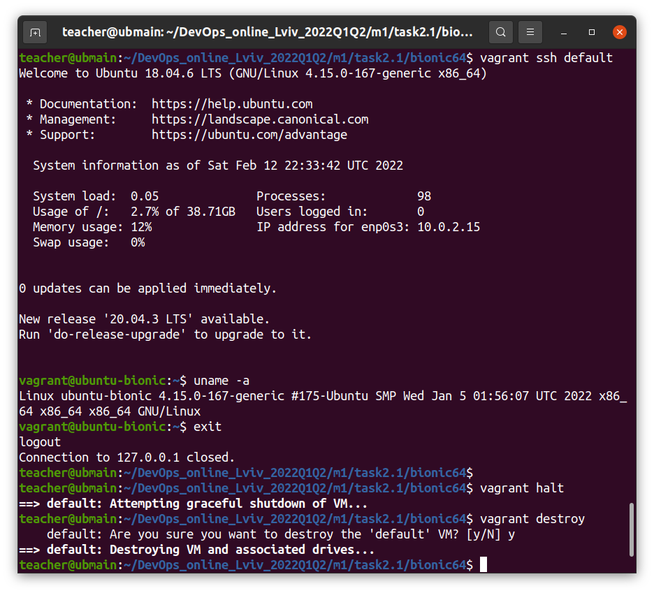

### What is a virtual machine?
> A Virtual Machine (VM) is a compute resource that uses software instead of a physical computer to run programs and deploy apps. One or more virtual “guest” machines run on a physical “host” machine.  Each virtual machine runs its own operating system and functions separately from the other VMs, even when they are all running on the same host. This means that, for example, a virtual MacOS virtual machine can run on a physical PC.

Source: https://www.vmware.com/topics/glossary/content/virtual-machine.html

### PART 1. POPULAR HYPERVISORS




### PART 2. WORK WITH VIRTUALBOX

>Create a group of two VM: VM1, VM2



>For VM1, changing its state and take snapshot



>Configuration of virtual machine



>Configure the USB to connect the USB ports of the host machine to the VM



>Configure a shared folder to exchange data between the virtual machine and the host



>Check  the  connection between machines



>Use basic  commands  of  VBoxManage




### PART 3. WORK WITH VAGRANT

### Install Vagrant
```bash
curl -fsSL https://apt.releases.hashicorp.com/gpg | sudo apt-key add -
sudo apt-add-repository "deb [arch=amd64] https://apt.releases.hashicorp.com $(lsb_release -cs) main"
sudo apt-get update && sudo apt-get install vagrant
```

### Hypervisors conflicts
```bash
$ lsmod | grep kvm
$ echo 'blacklist kvm-intel' >> /etc/modprobe.d/blacklist.conf
```

### Simple start
vagrant init ubuntu/bionic64

>Vagrantfile

```bash
Vagrant.configure("2") do |config|
  config.vm.box = "hashicorp/bionic64"
end
```

### Basic commands
vagrant up

vagrant status

vagrant ssh-config

vagrant ssh default

vagrant halt

vagrant destroy -f

>Example

