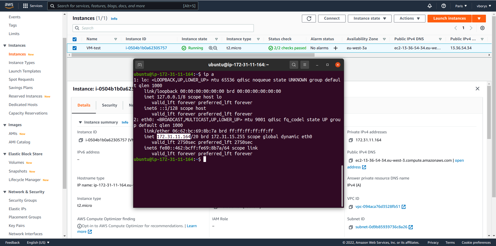
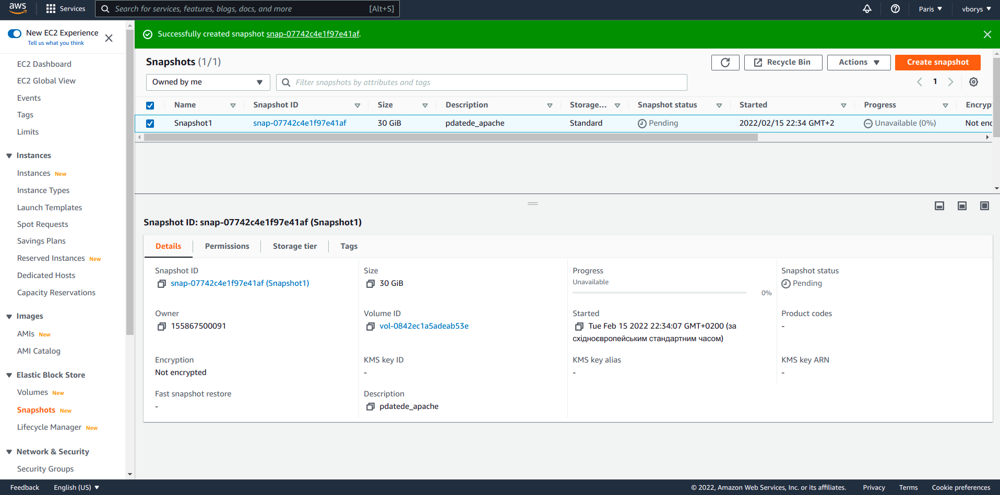
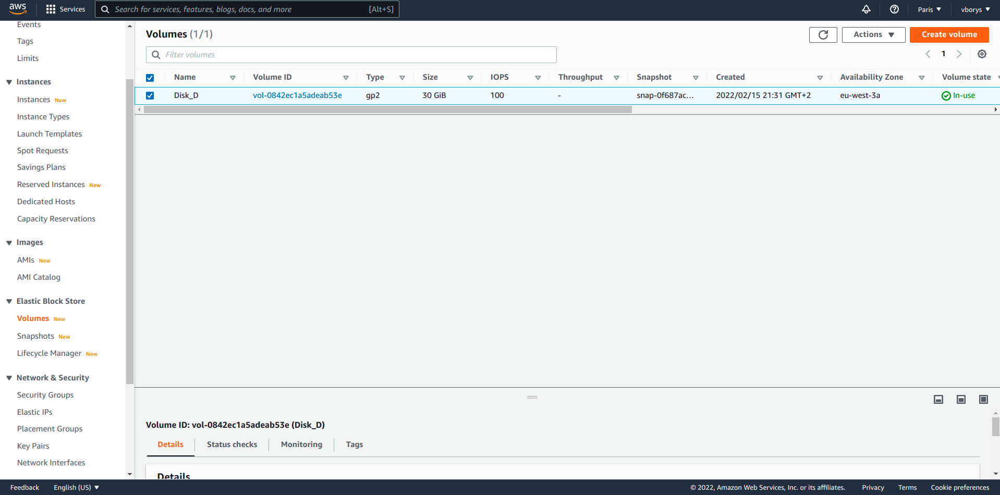

## Virtualization and Cloud Basic

> Amazon Web Services, Inc. (AWS) is a subsidiary of Amazon providing on-demand cloud computing platforms and APIs to individuals, companies, and governments, on a metered pay-as-you-go basis. These cloud computing web services provide a variety of basic abstract technical infrastructure and distributed computing building blocks and tools. One of these services is Amazon Elastic Compute Cloud (EC2), which allows users to have at their disposal a virtual cluster of computers, available all the time, through the Internet. AWS's virtual computers emulate most of the attributes of a real computer, including hardware central processing units (CPUs) and graphics processing units (GPUs) for processing; local/RAM memory; hard-disk/SSD storage; a choice of operating systems; networking; and pre-loaded application software such as web servers, databases, and customer relationship management (CRM).

Source: https://en.wikipedia.org/wiki/Amazon_Web_Services

## Task 2.2

### Create EC2 instanse and check SSH connection

### Create a snapshot of instance to it keep as a backup.

### Create and attach a Disk_D (EBS) to instance to add more storage space.

## Info

AWS registration: https://www.youtube.com/watch?v=f1s6Eq4nx0g
