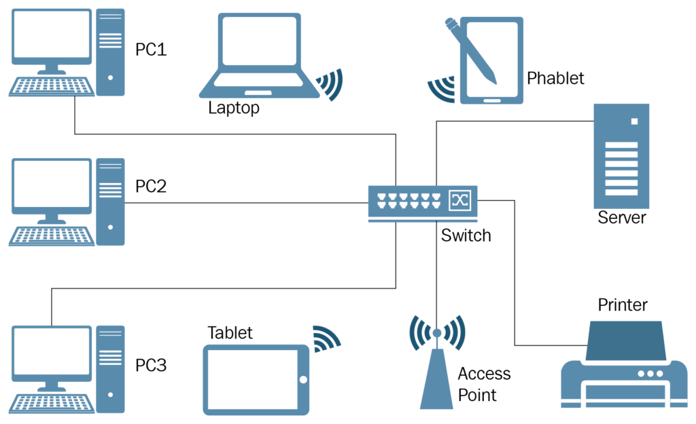
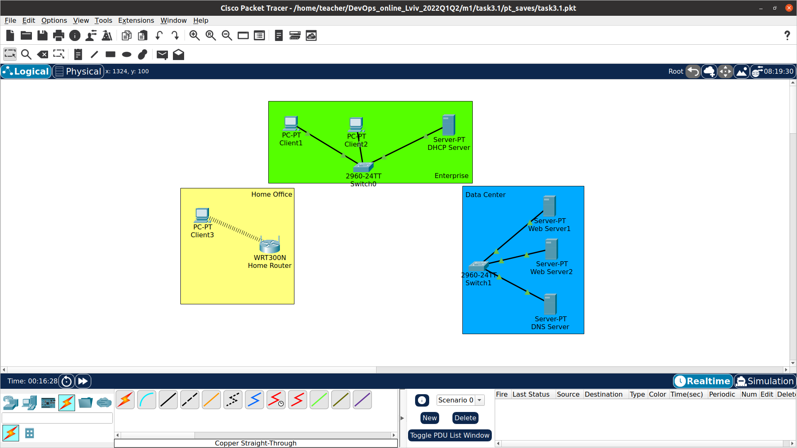
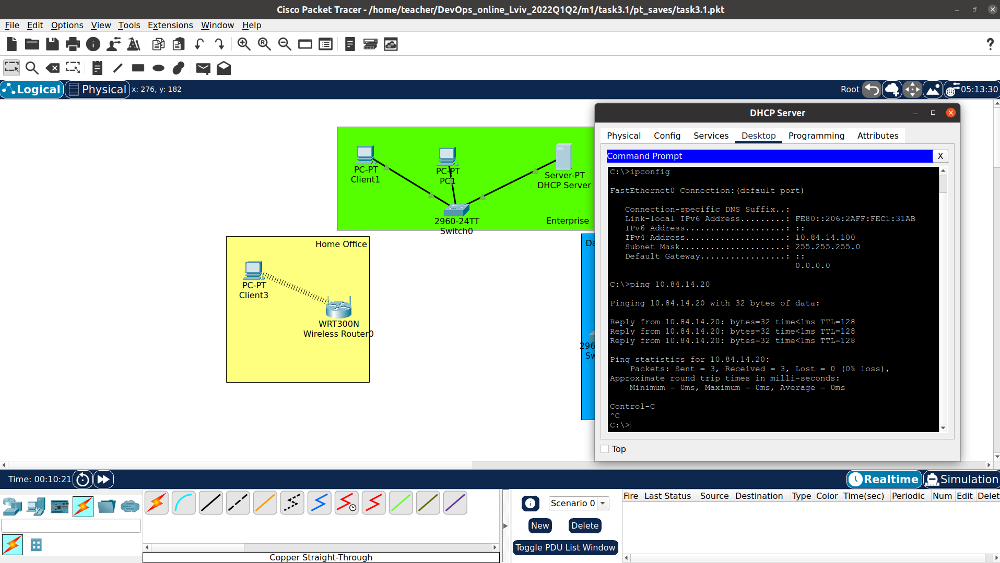
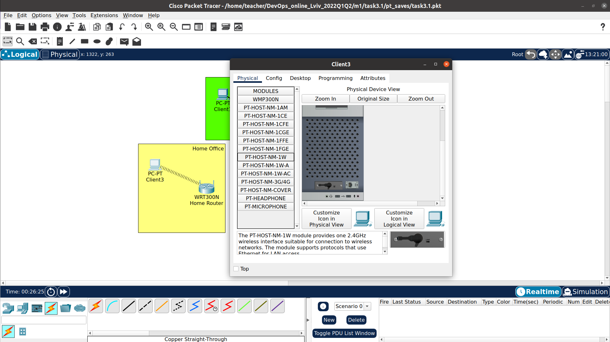

## Networking Fundamentals

> When most people think of computer networks they think of large businesses. Many people have networked their home systems to enable a shared internet connection, shared files and even shared printing capabilities. The process of sharing resources and data between more than one computer is referred to as computer networking. The network can be divided into a local or small area network such as a LAN network where computers are shared within an office building or home space, MAN where two or more locations are connected throughout an area and WAN where the network can be created to connect to a home or office from anywhere in the country.

Source: http://enrollsnorton.com/understanding-computer-networks/

## Task 3.1

### Create EC2 instanse and check SSH connection

