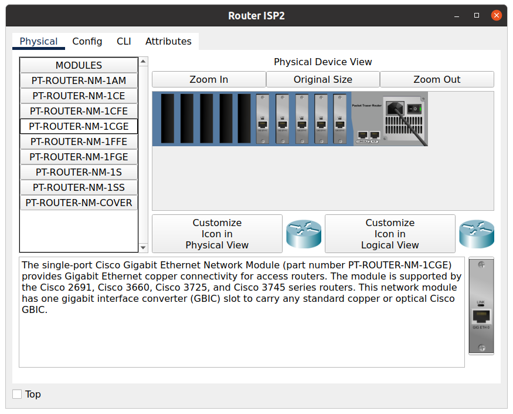

## Task 3.2

### Add 5 modoles 1CGE to RouterISP

### New network scheme
 

### Add connections

### Config RouterISP

### Check connections

## Configure VLAN in Data Center

### Difference betwen netmask /24 & /26

### Explanation

## Additional task
### Config VLAN routing by CLI

### Check connections

