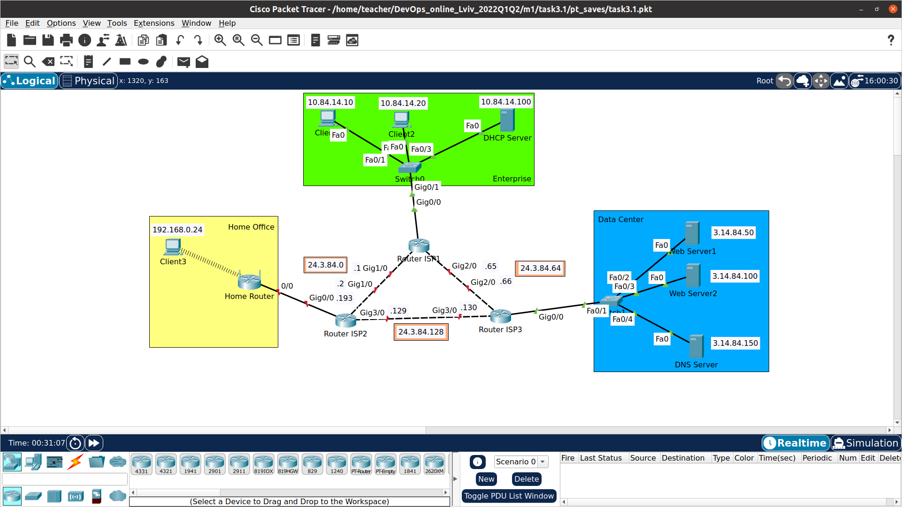
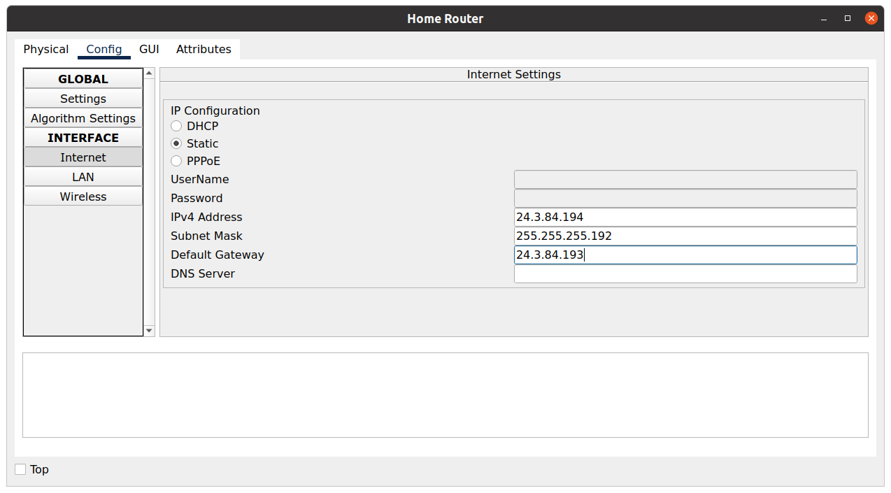
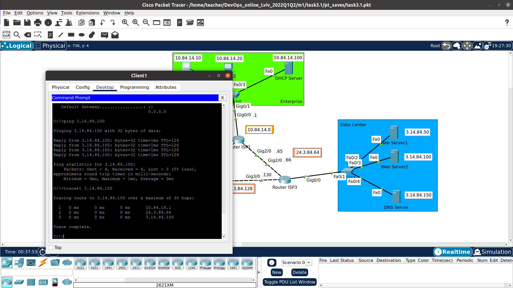
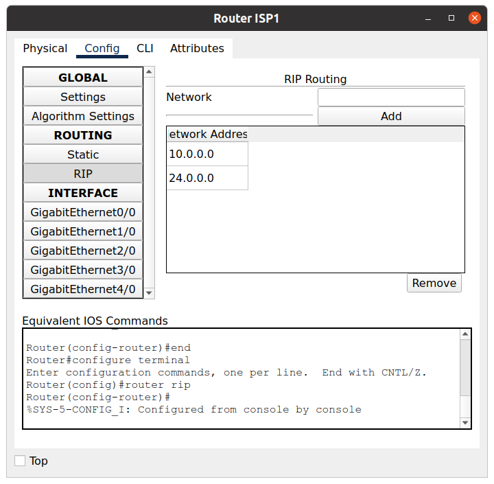
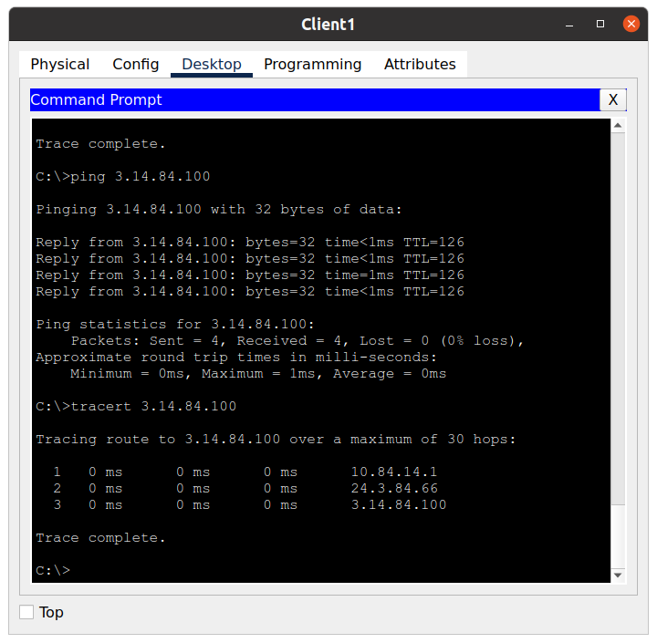

## Task 3.3

### Check all network scheme

### Config Home router
 

### Config static routing tables & ON ISP's network )

### Check connections

### Add RIP Routing

### Check connections again

