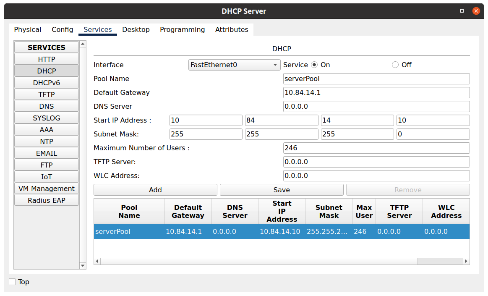
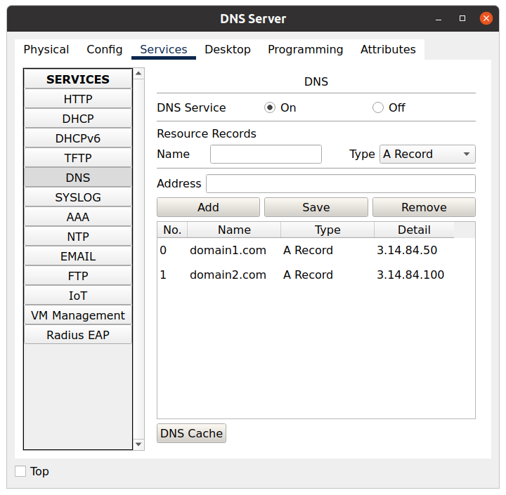
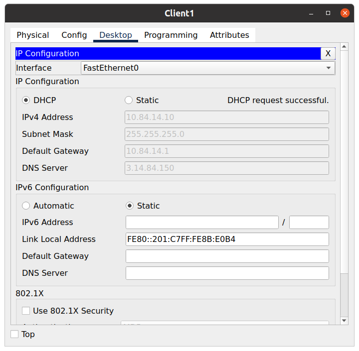
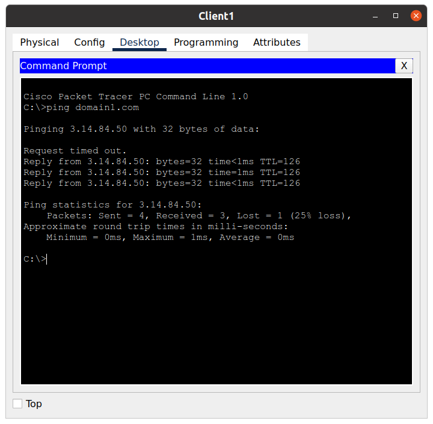
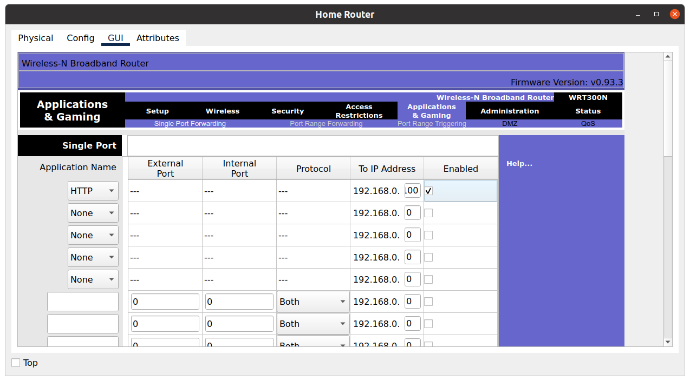
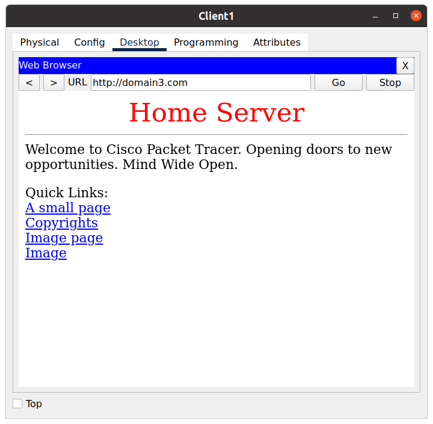
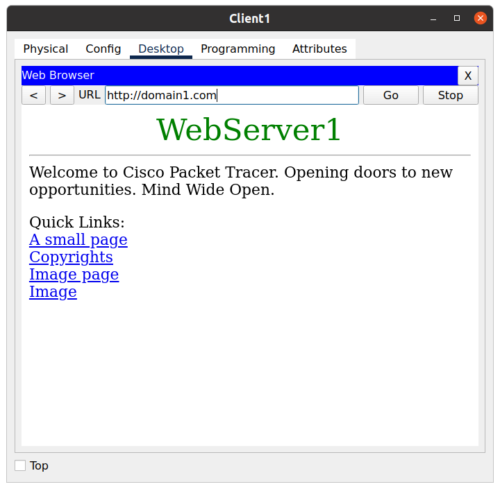

## Task 3.4

### Config DHCP Pool

### Enable DHCP in clients

### Add DNS records

### Reenable DHCP with DNS string

### Ping HTTP server

### Enable Port Forwarding on Home Router

### Check HTTP all requests 

