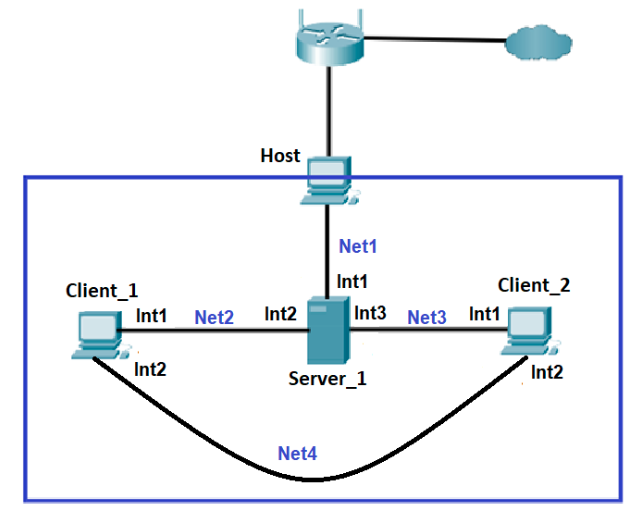
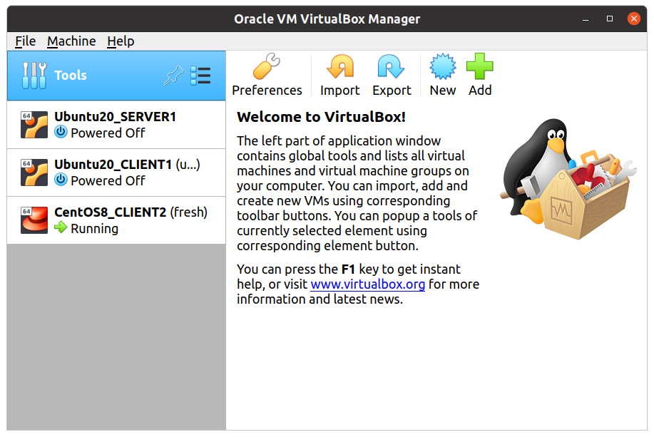
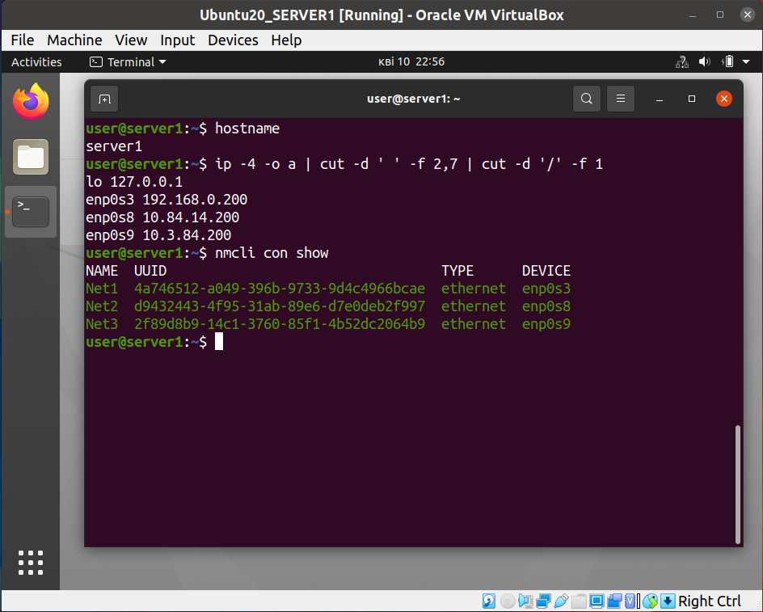
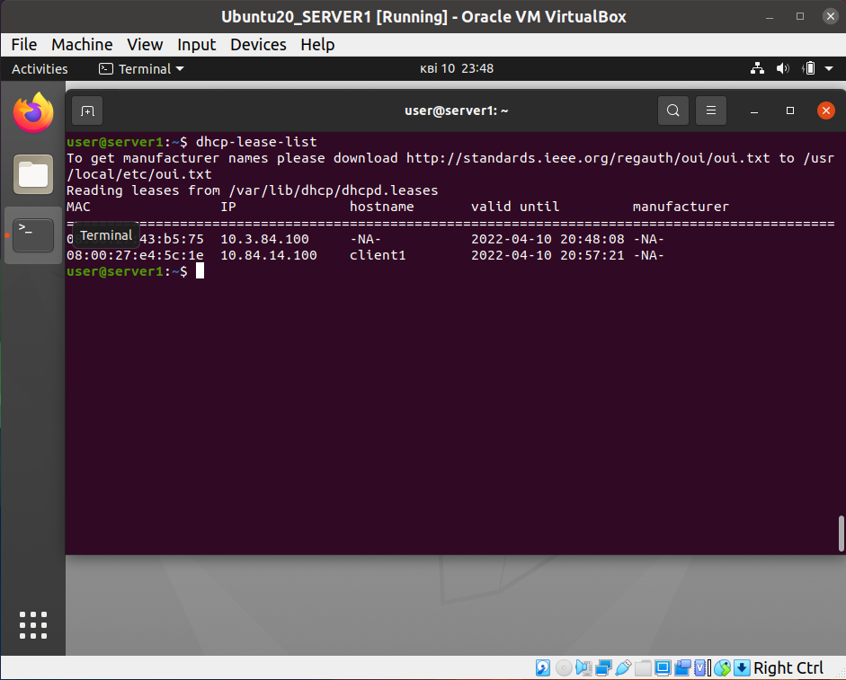
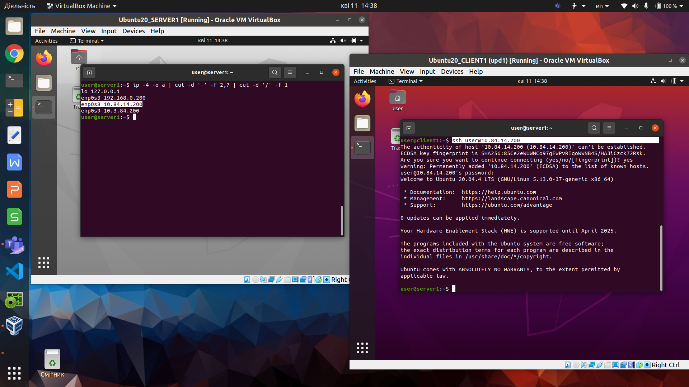
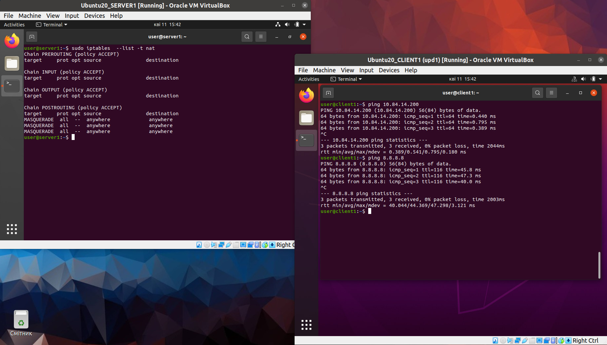

## Task 5

### Install and prepare VM's

### Server network interfaces & IP's

### DHCP settings

### SSH

### Configure NAT

## Info

* DHCP
https://www.youtube.com/watch?v=j3wsYskgdAs

https://www.tecmint.com/install-dhcp-server-in-ubuntu-debian/

* NAT

https://kifarunix.com/configure-ubuntu-20-04-as-linux-router/
